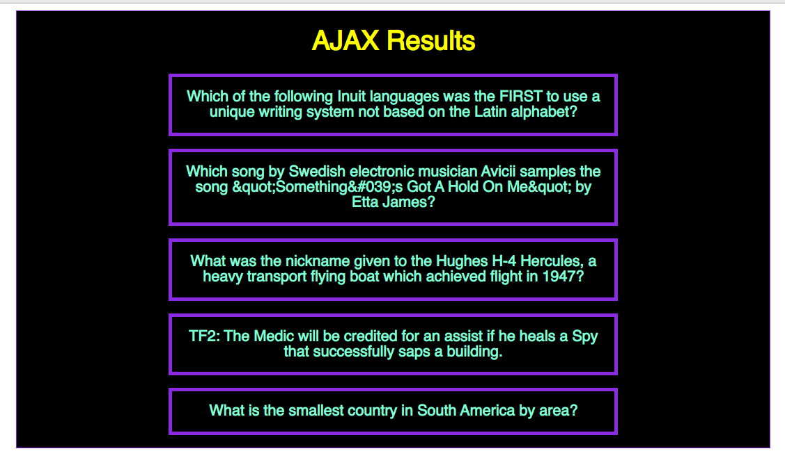
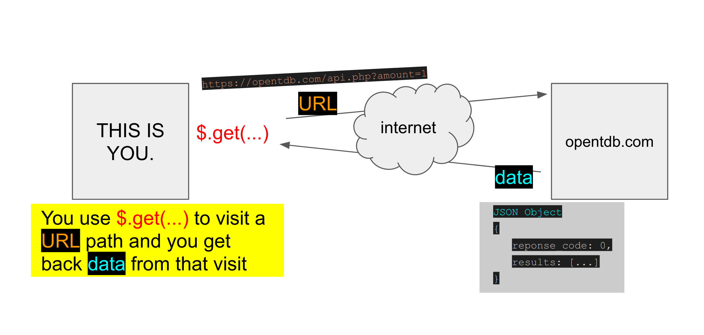

# AJAX Example using $.get(...)

This repo contains example code demonstrating what an AJAX request looks like using the *jquery* `$.get(...)` method.

**Pre-requisite knowledge:**
 - DOM API
 - Using Callback Functions
 - Asychronous Code Execution

## Getting Started

To get started:

- Fork this repository to your own github account
- Clone that fork down to your local machine
- On your computer, find the file path to the index.html page in this repo. *example: /home/YOURNAME/ajax-intro/index.html*. Be aware that your path may be completely different depending on where on your machine you cloned down the repo.
- Once you have it up and running, be sure to open your browser inspector and look at the console
- You'll get new results each time you refresh the page
- Look at the `app.js` file and feel free to play around with the code
- Try making a request to a different API! [Here's a list of open access APIs](https://mixedanalytics.com/blog/list-actually-free-open-no-auth-needed-apis/)

## Recap /w diagram

